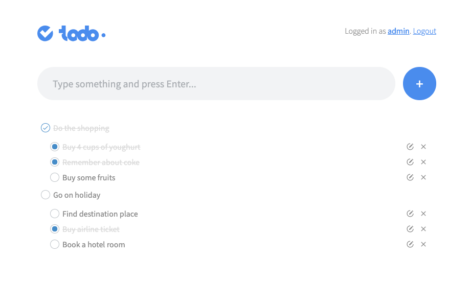

# Todoo is a simple task management app.


Todoo is a fully functional task management app, however it's still under development and there is a couple of things that need implementation or improvement.

### Current Features
- CRUD operations on tasks and subtasks
- user authentication
- support for multiple accounts
- account data update
- sleek UI

### Screenshots


### Features to be added soon
- task deadlines
- extended admin account allowing for manipulating users
- new user sign up page

### Installation

Before starting the application make sure you have a running instance of MySQL.
Also before the first run you should manually create a database called ```tasks```.
Make sure that ```application.properties``` file contains proper user and password information for your running instance of MySQL.

You can start the application by running it from within your favourite IDE which supports maven or you can start it directly from command line by typing:
```mvn spring-boot:run``` (please make sure that you have maven istalled on your system).

If you run the application locally you can get access to it by typing: ```localhost:8080``` in your web browser window. The credentials for the preloaded admin account are:
login: admin
password: password

Please note that since the application is still in development phase the ```hibernate.hbm2ddl.auto property``` is set to ```create-drop``` which creates the schema on each start of the application and destroys it on each exit.

### Built with

- Java
- Maven
- Spring Boot
- MySQL
- Lombok
- Swagger and SpringFox
- JUnit 5 and Mockito
- H2 database (for testing)
- AngularJS
- [ng-file-upload](https://github.com/danialfarid/ng-file-upload)